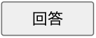
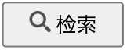

# [ChineseTyping](https://topaz13.github.io/ChineseTyping/)

topaz が自身のために作った中国語単語学習サイトです。[こちら](https://topaz13.github.io/ChineseTyping/)からプレイすることができます。  
プログラミングは目的ではないので雑に開発しました。  
スマホで行うことを想定しており、topaz の端末(iPhone12mini)でみやすいレイアウトに調整しました。PC でも動作の確認をしております。他の環境だとレイアウトがくずれる恐れがあります。  
※topaz は中国語初心者なため、間違い等ある恐れがあります。

---

## 使い方

リンクに飛べばすぐに使用可能です。

- 入力方法

```
英語キーボード(予測変換なし)を使用。
母音複数回入力で四音変化.
例) "aa"と入力すると自動で"ā"に変換。
aの後に数字(1,2,3,4)を入力することで、声調変化させることができます。
```

- 回答機能  
  わからない時は`回答`を押して答えをみることができる。  
  

- 検索機能  
  単語の発音や詳細を調べたい時は`检索`を押して、[Weblio 日中中日辞典](https://cjjc.weblio.jp/)で調べることができる。  
  

- To be continue...

---

## 収録単語

- HSK1 級 153 語
  - [単語リストダウンロード元](https://12daimedaimonya-chinese.com/hsk-word-download/)
- To be continue. . .

## さいごに

中国語の勉強頑張りましょう!!
